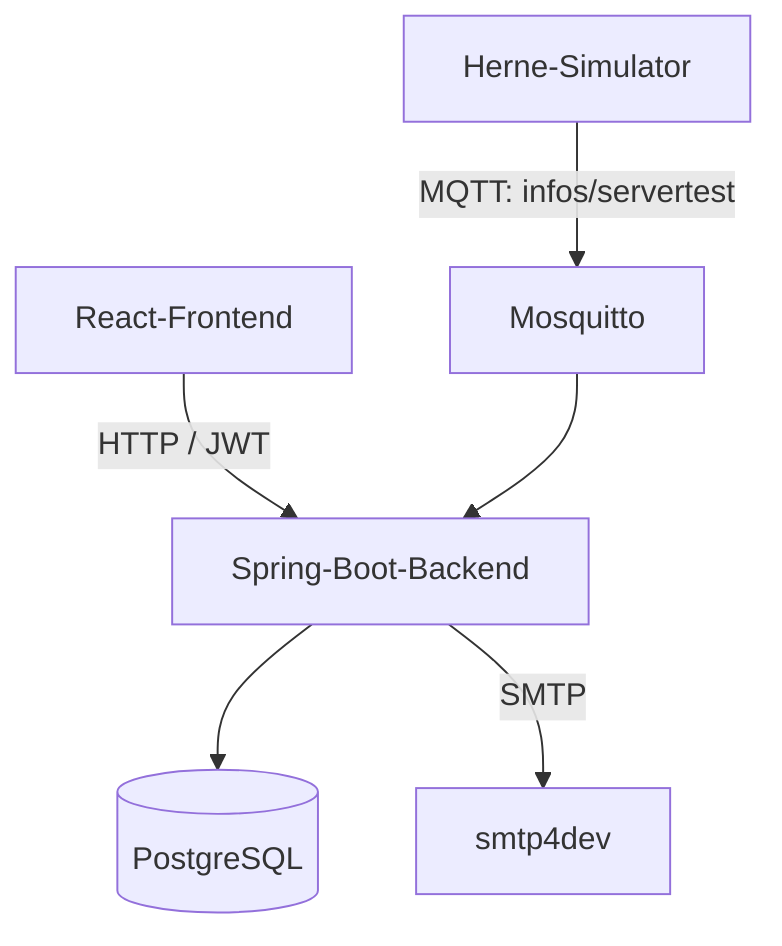

# Herne Event App

Teamprojekt für die Veröffentlichung, Suche, Verwaltung und Buchung von Veranstaltungen in Herne. Das System verbindet ein React-Frontend mit zwei Spring-Boot-Diensten sowie PostgreSQL, MQTT und einer lokalen E-Mail-Testumgebung.

**Technischer Schwerpunkt:** Java 21 · Spring Boot · React 18 · PostgreSQL · MQTT · Docker Compose · JWT · OpenAPI

> **Projektstatus:** Entwicklungs- und Demonstrationsstand. Das Gesamtsystem lässt sich lokal mit Docker Compose starten, ist wegen der dokumentierten [Sicherheitsrisiken und Einschränkungen](#bekannte-einschränkungen-und-sicherheitsrisiken) aber noch nicht für einen öffentlichen Produktivbetrieb vorgesehen.

## Inhalt

- [Projektüberblick](#projektüberblick)
- [Mein Beitrag](#mein-beitrag)
- [Funktionen](#funktionen)
- [Architektur](#architektur)
- [Technologien](#technologien)
- [Schnellstart mit Docker Compose](#schnellstart-mit-docker-compose)
- [Erste Anmeldung und Admin-Zugang](#erste-anmeldung-und-admin-zugang)
- [Herne-Simulator verwenden](#herne-simulator-verwenden)
- [API und Authentifizierung](#api-und-authentifizierung)
- [Lokale Entwicklung](#lokale-entwicklung)
- [Konfiguration](#konfiguration)
- [Datenmodell](#datenmodell)
- [Tests und Builds](#tests-und-builds)
- [Projektstruktur](#projektstruktur)
- [Fehlerbehebung](#fehlerbehebung)
- [Bekannte Einschränkungen und Sicherheitsrisiken](#bekannte-einschränkungen-und-sicherheitsrisiken)
- [Lizenz](#lizenz)

## Projektüberblick

- Eventsuche, Detailansicht und Buchung für registrierte Benutzer
- Verwaltungsfunktionen für Events, Buchungen, Benutzer und Rollen
- Separater Herne-Simulator zur Übertragung von Veranstaltungsdaten per MQTT
- Lokale Gesamtumgebung mit PostgreSQL, Mosquitto und smtp4dev
- REST-APIs mit JWT-Authentifizierung und OpenAPI-/Swagger-Dokumentation

## Mein Beitrag

Das Projekt entstand als Teamarbeit im Fachschaftsrat Informatik der Fachhochschule Dortmund. Mein Schwerpunkt lag auf:

- REST-APIs mit Java und Spring Boot für Events, Benutzerverwaltung und Authentifizierung
- rollen- und benutzerbasierter Zugriffskontrolle
- klarer Trennung von Frontend, Backend, API-Logik und Infrastruktur
- reproduzierbarer lokaler Entwicklungsumgebung mit Docker Compose und PostgreSQL

## Funktionen

### Für Besucher und registrierte Benutzer

- Benutzerkonto registrieren und per JWT anmelden
- Veranstaltungen anzeigen, filtern und seitenweise durchsuchen
- Veranstaltungsdetails mit Ort, Termin, Kategorien und Auslastung öffnen
- Veranstaltung buchen
- Buchung über den Bestätigungscode finden
- Eigene Profildaten bearbeiten
- Eigene Buchungen einsehen und stornieren

### Für Administratoren

- Benutzer anzeigen, bearbeiten und löschen
- Rollen zwischen `USER` und `ADMIN` ändern
- Buchungen verwalten und im Kalender anzeigen
- Veranstaltungen über die Backend-API anlegen, bearbeiten und löschen
- Rundmail an registrierte Benutzer auslösen

### Systemintegration

- Veranstaltungen über den Herne-Simulator als Multipart-Anfrage einreichen
- Übertragung vom Simulator zum Hauptbackend per MQTT
- Neue Veranstaltungen anlegen oder bestehende anhand der `herneID` aktualisieren
- Buchungs- und Stornierungs-E-Mails lokal mit smtp4dev prüfen
- REST-APIs über OpenAPI/Swagger untersuchen

## Architektur



| Dienst | Aufgabe | Interner Port | Host-Port |
| --- | --- | ---: | ---: |
| `frontend` | React-Weboberfläche | 3000 | 3000 |
| `backend` | Haupt-API, Authentifizierung, Events, Buchungen, Benutzer | 8080 | 8090 |
| `backend-herne` | Simuliert die Event-Schnittstelle der Stadt Herne | 8081 | 8091 |
| `database` | PostgreSQL-Datenbank `eventsManagement` | 5432 | 5433 |
| `mosquitto` | MQTT-Broker | 1883 / 9001 | 1883 / 9001 |
| `smtp4dev` | SMTP-Testserver und Weboberfläche | 25 / 80 | 2525 / 5000 |

Der Simulator veröffentlicht JSON-Nachrichten im Topic `infos/servertest`. Das Hauptbackend abonniert dieses Topic und speichert die empfangenen Events in PostgreSQL. Bilder werden dabei als Base64-Text übertragen und in der Datenbank gespeichert.

## Technologien

| Bereich | Technologie |
| --- | --- |
| Frontend | React 18, React Router 7, Axios, React Calendar, React Datepicker, Leaflet |
| Hauptbackend | Java 21, Spring Boot 3.4.6, Spring Web, Spring Security, Spring Data JPA |
| Herne-Simulator | Java 17 laut Maven-Konfiguration, Spring Boot 3.5.0 |
| Authentifizierung | JWT mit JJWT 0.12.5, BCrypt |
| Datenbank | PostgreSQL |
| Messaging | Eclipse Paho MQTT, Eclipse Mosquitto |
| API-Dokumentation | springdoc-openapi / Swagger UI |
| E-Mail-Tests | Spring Mail, smtp4dev |
| Container | Docker, Docker Compose |

Die Dockerfiles bauen beide Backends mit Java 21. Für eine einheitliche lokale Toolchain ist daher Java 21 die sinnvollste Wahl. Das Frontend-Dockerfile nutzt noch Node.js 18, während React Router 7.6.2 laut Paketdefinition mindestens Node.js 20 erwartet. Diese Versionsabweichung sollte bereinigt werden.

## Schnellstart mit Docker Compose

### Voraussetzungen

- Docker Engine oder Docker Desktop
- Docker Compose v2 (`docker compose`)
- freie Host-Ports `1883`, `3000`, `5000`, `5433`, `8090`, `8091` und `9001`

### Anwendung starten

```bash
git clone https://github.com/joeltchoffo/herne-app.git
cd herne-app
docker compose up --build -d
```

Status und Logs prüfen:

```bash
docker compose ps
docker compose logs -f backend backend-herne frontend
```

Beim ersten Start müssen Images geladen, Maven-Abhängigkeiten aufgelöst, npm-Pakete installiert und die Datenbanktabellen erzeugt werden. Das kann mehrere Minuten dauern.

### Oberflächen

| Ziel | URL |
| --- | --- |
| Webanwendung | <http://localhost:3000> |
| Swagger UI des Hauptbackends | <http://localhost:8090/swagger-ui/index.html> |
| OpenAPI-JSON des Hauptbackends | <http://localhost:8090/v3/api-docs> |
| Swagger UI des Herne-Simulators | <http://localhost:8091/swagger-ui/index.html> |
| OpenAPI-JSON des Herne-Simulators | <http://localhost:8091/v3/api-docs> |
| smtp4dev | <http://localhost:5000> |

### Anwendung stoppen

Container stoppen und behalten:

```bash
docker compose stop
```

Container und Netzwerk entfernen:

```bash
docker compose down
```

Lokale Volumes ebenfalls löschen:

```bash
docker compose down -v
```

Der letzte Befehl entfernt lokale Containerdaten unwiderruflich.

## Erste Anmeldung und Admin-Zugang

1. Unter <http://localhost:3000/register> ein Benutzerkonto anlegen.
2. Unter <http://localhost:3000/login> anmelden.
3. Für reine Benutzerfunktionen ist keine weitere Einrichtung nötig.

Jede öffentliche Registrierung erhält im Backend fest die Rolle `USER`. Für das erste Administratorkonto existiert aktuell kein Bootstrap-Prozess. In einer lokalen Entwicklungsumgebung kann ein bereits registrierter Benutzer deshalb direkt in PostgreSQL hochgestuft werden:

```bash
docker compose exec database psql \
  -U admin_user \
  -d eventsManagement \
  -c "UPDATE users SET role = 'ADMIN' WHERE email = 'admin@example.org';"
```

Danach abmelden und erneut anmelden, damit ein neues JWT und die aktualisierte Rolle im Browser gespeichert werden. Dieses Vorgehen ist nur für die lokale Entwicklung gedacht.

## Herne-Simulator verwenden

Der Simulator nimmt `POST /send` als `multipart/form-data` entgegen:

- Part `event`: Event als JSON-Text
- Part `image`: Bilddatei

Beispiel:

```bash
curl --request POST http://localhost:8091/send \
  --form 'event={
    "status":"ACTIVE",
    "herneID":"HERNE-001",
    "eventDate":"2026-08-15",
    "eventLocation":{
      "city":"Herne",
      "street":"Friedrich-Ebert-Platz",
      "houseNumber":2,
      "zip":44623
    },
    "maxParticipant":100,
    "eventPhoto":"",
    "eventDescription":"Beispielveranstaltung aus dem Herne-Simulator",
    "eventName":"Sommerabend 2026",
    "startTime":"18:00",
    "endTime":"20:00",
    "categories":[{"name":"Kultur"}]
  }' \
  --form 'image=@./event.jpg;type=image/jpeg'
```

`eventPhoto` muss im aktuellen DTO vorhanden sein, obwohl der Simulator den Wert anschließend durch das hochgeladene Bild ersetzt. Beim erneuten Senden derselben `herneID` wird das vorhandene Event aktualisiert. `status` akzeptiert `ACTIVE`, `CANCELLED` oder `EXPIRED`; Uhrzeiten verwenden das Format `HH:mm`.

Nach erfolgreicher Übertragung erscheint das Event im Hauptbackend und im Frontend. Bei Problemen helfen diese Logs:

```bash
docker compose logs -f backend-herne mosquitto backend
```

## API und Authentifizierung

Das Hauptbackend antwortet überwiegend mit einem gemeinsamen Response-Objekt. Je nach Endpunkt enthält es unter anderem:

```json
{
  "statusCode": 200,
  "message": "Successful",
  "token": "<jwt>",
  "role": "USER",
  "user": {},
  "event": {},
  "booking": {},
  "userList": [],
  "eventList": [],
  "bookingList": []
}
```

Nicht benötigte Felder werden nicht ausgegeben. Geschützte Aufrufe erwarten:

```http
Authorization: Bearer <jwt>
```

Das Frontend speichert Token und Rolle im `localStorage`. Ein Login-Token ist laut Backend sieben Tage gültig.

### Hauptbackend

| Methode | Pfad | Zugriff | Zweck |
| --- | --- | --- | --- |
| `POST` | `/auth/register` | öffentlich | Benutzer registrieren; Rolle wird immer `USER` |
| `POST` | `/auth/login` | öffentlich | Anmelden und JWT ausgeben |
| `PUT` | `/auth/update` | `USER` | Eigenes Profil ändern |
| `PUT` | `/auth/update-user?email=…` | `ADMIN` | Profil eines Benutzers ändern |
| `GET` | `/events/all` | öffentlich | Alle Events abrufen |
| `GET` | `/events/categories` | öffentlich | Kategorien abrufen |
| `GET` | `/events/event-by-id/{eventID}` | öffentlich | Event mit Buchungen abrufen |
| `GET` | `/events/all-available-events` | öffentlich | Buchbare zukünftige Events abrufen |
| `POST` | `/events/add` | `ADMIN` | Event anlegen |
| `PUT` | `/events/update/{eventID}` | `ADMIN` | Event ändern |
| `DELETE` | `/events/delete/{eventID}` | `ADMIN` | Event löschen |
| `POST` | `/events/notify` | derzeit öffentlich | Rundmail versenden |
| `POST` | `/bookings/book-event/{eventID}/{userId}` | `USER` oder `ADMIN` | Event buchen |
| `GET` | `/bookings/all` | `ADMIN` | Alle Buchungen abrufen |
| `GET` | `/bookings/get-by-confirmation-code/{code}` | öffentlich | Buchung anhand des Codes finden |
| `DELETE` | `/bookings/cancel/{bookingId}` | `USER` oder `ADMIN` | Buchung stornieren |
| `GET` | `/users/all` | `ADMIN` | Alle Benutzer abrufen |
| `GET` | `/users/get-by-id/{userId}` | angemeldet | Benutzer abrufen |
| `GET` | `/users/get-logged-in-profile-info` | angemeldet | Eigenes Profil abrufen |
| `GET` | `/users/get-user-bookings/{userId}` | angemeldet | Buchungen eines Benutzers abrufen |
| `PUT` | `/users/update/{id}` | `ADMIN` | Benutzer und Rolle ändern |
| `DELETE` | `/users/delete/{userId}` | `ADMIN` | Benutzer löschen |
| `POST` | `/users/send-feedback` | `USER` | Noch nicht implementierter Feedback-Endpunkt |

Die Swagger UI ist die verlässlichste Quelle für Request- und Response-Schemas. Für geschützte Aufrufe dort zuerst anmelden, das JWT kopieren und über **Authorize** als Bearer-Token setzen.

### Herne-Simulator

| Methode | Pfad | Zugriff | Zweck |
| --- | --- | --- | --- |
| `POST` | `/send` | öffentlich | Event und Bild validieren und per MQTT veröffentlichen |

## Lokale Entwicklung

Docker Compose ist der vorgesehene Weg, da Quellcode und Konfiguration interne DNS-Namen wie `database`, `mosquitto` und `smtp4dev` verwenden.

### Frontend separat starten

Voraussetzungen: Node.js 20 oder neuer und npm. Das weicht vom derzeitigen Frontend-Dockerfile ab, verhindert aber den bekannten Engine-Konflikt mit React Router 7.

```bash
cd frontend_app
npm ci
npm start
```

Das Frontend erwartet das Hauptbackend fest unter `http://localhost:8090`. Die Basis-URL steht in `frontend_app/src/service/ApiService.js`.

### Hauptbackend separat starten

Voraussetzungen: Java 21 und Maven 3.9 oder neuer.

```bash
cd backend
mvn spring-boot:run
```

Außerhalb des Compose-Netzwerks müssen mindestens Datenbank-, MQTT- und SMTP-Hostnamen angepasst oder lokal auflösbar gemacht werden.

### Herne-Simulator separat starten

```bash
cd backend_herne
mvn spring-boot:run
```

Auch hier muss der MQTT-Broker unter dem im Quellcode konfigurierten Host erreichbar sein.

## Konfiguration

Die Anwendung verwendet aktuell keine `.env`-Datei und keine konsistente Umgebungsvariablen-Konfiguration. Relevante Stellen:

| Konfiguration | Datei |
| --- | --- |
| Container, Ports, PostgreSQL-Zugang | `docker-compose.yaml` |
| Datenbank, SMTP, Upload-Limits, Backend-Port | `backend/src/main/resources/application.properties` |
| Simulator-Port und Upload-Limits | `backend_herne/src/main/resources/application.properties` |
| Frontend-API-URL | `frontend_app/src/service/ApiService.js` |
| MQTT-Broker, Topic und Client-IDs | `PublisherService.java` und `MqttSubject.java` |
| Mosquitto-Zugriff | `mosquitto/mosquitto.conf` |

Aktuelle Entwicklungswerte:

| Wert | Konfiguration |
| --- | --- |
| Datenbank | `eventsManagement` |
| Datenbankbenutzer | `admin_user` |
| Datenbank-Host im Compose-Netz | `database:5432` |
| SMTP-Host im Compose-Netz | `smtp4dev:25` |
| MQTT-Broker im Compose-Netz | `mosquitto:1883` |
| MQTT-Topic | `infos/servertest` |
| Maximale Upload-Größe | 2 GB |
| JPA-Schema-Verhalten | `hibernate.ddl-auto=update` |

Für andere Umgebungen sollten Zugangsdaten, JWT-Schlüssel, externe URLs, CORS-Regeln und Broker-Konfiguration über Umgebungsvariablen oder ein Secret-Management bereitgestellt werden.

## Datenmodell

| Entität | Wesentliche Beziehungen |
| --- | --- |
| `User` | besitzt mehrere Buchungen und Feedback-Einträge |
| `Event` | gehört zu einem Ort, besitzt Kategorien, Buchungen und Feedback |
| `Booking` | verbindet genau einen Benutzer mit genau einem Event |
| `Category` | steht in einer n:m-Beziehung zu Events |
| `Location` | kann mehreren Events zugeordnet sein |
| `Feedback` | verweist auf Benutzer und Event |

Event-Statuswerte sind `ACTIVE`, `CANCELLED` und `EXPIRED`. Eventname und `herneID` sind in der Datenbank eindeutig.

## Tests und Builds

### Frontend

```bash
cd frontend_app
npm ci
npm test -- --watchAll=false
npm run build
```

Der Testlauf schlägt mit der aktuellen Kombination aus Create React App 5 und React Router 7 bereits bei der Modulauflösung von `react-router-dom` fehl. Der einzige Test in `src/App.test.js` ist außerdem noch der Create-React-App-Beispieltest und erwartet den nicht mehr vorhandenen Text „learn react“. Er prüft keine reale Funktion der App. `npm run build` erzeugt dagegen einen Produktionsbuild, aktuell mit einer ESLint-Warnung wegen einer ungenutzten Variable in `ManageBookingsPage.jsx`.

### Hauptbackend

```bash
cd backend
mvn clean verify
```

### Herne-Simulator

```bash
cd backend_herne
mvn clean verify
```

In beiden Backend-Projekten sind aktuell keine Tests unter `src/test` vorhanden. Die GitHub-Actions-Dateien enthalten außerdem keine wirksame Projektmatrix; der aktuelle CI-Stand baut die Anwendung daher nicht zuverlässig. Ein grüner lokaler Build ersetzt noch keine Integrations- oder Sicherheitstests.

## Projektstruktur

```text
herne-app/
├── backend/                  # Hauptbackend mit REST, JPA, JWT, Mail und MQTT-Subscriber
│   ├── src/main/java/...
│   ├── src/main/resources/application.properties
│   ├── Dockerfile
│   └── pom.xml
├── backend_herne/            # Simulator und MQTT-Publisher
│   ├── src/main/java/...
│   ├── src/main/resources/application.properties
│   ├── Dockerfile
│   └── pom.xml
├── frontend_app/             # React-Anwendung
│   ├── public/
│   ├── src/components/
│   ├── src/service/
│   ├── Dockerfile
│   └── package.json
├── mosquitto/mosquitto.conf  # Lokale Broker-Konfiguration
├── docker-compose.yaml       # Gesamtsystem für die Entwicklung
├── LICENSE
└── README.md
```

## Fehlerbehebung

### Ein Port ist bereits belegt

In `docker-compose.yaml` nur den Host-Port links vom Doppelpunkt ändern. Beispiel:

```yaml
ports:
  - "8092:8080"
```

Danach müssen Aufrufer wie die Frontend-`BASE_URL` ebenfalls auf den neuen Host-Port zeigen.

### Backend startet vor PostgreSQL oder Mosquitto

`depends_on` steuert nur die Startreihenfolge und wartet nicht auf Betriebsbereitschaft. Falls das Backend beim ersten Start die Verbindung verliert:

```bash
docker compose restart backend backend-herne
docker compose logs -f backend backend-herne
```

### Frontend erreicht das Backend nicht

- Prüfen, ob <http://localhost:8090/v3/api-docs> erreichbar ist.
- In der Browserkonsole nach CORS- oder Netzwerkfehlern suchen.
- Prüfen, ob `ApiService.BASE_URL` zum veröffentlichten Backend-Port passt.

### Keine E-Mail sichtbar

- smtp4dev unter <http://localhost:5000> öffnen.
- `docker compose logs smtp4dev backend` prüfen.
- Sicherstellen, dass das Backend `smtp4dev:25` im Compose-Netz erreicht.

### Ein Event aus dem Simulator erscheint nicht

- Für alle Pflichtfelder gültige Werte senden.
- `eventPhoto` im JSON mitsenden und zusätzlich einen `image`-Part hochladen.
- Auf eindeutige Werte für `herneID` und `eventName` achten.
- Logs von `backend-herne`, `mosquitto` und `backend` gemeinsam prüfen.

### Datenbank vollständig neu erzeugen

```bash
docker compose down -v
docker compose up --build -d
```

Dabei gehen sämtliche lokalen Daten verloren.

## Bekannte Einschränkungen und Sicherheitsrisiken

Die folgenden Punkte sind im aktuellen Code vorhanden und sollten vor einem Produktivbetrieb behoben werden:

- Der JWT-Signaturschlüssel ist im Quellcode hinterlegt und muss in ein Secret-Management ausgelagert und rotiert werden.
- Datenbankzugangsdaten stehen im Repository und sind nur als lokale Entwicklungswerte vertretbar.
- Mosquitto erlaubt anonyme Verbindungen; Authentifizierung und TLS fehlen.
- CORS erlaubt jede Origin (`*`).
- `POST /events/notify` ist trotz Admin-Oberfläche öffentlich erreichbar und kann Rundmails auslösen.
- Mehrere Event- und Booking-Pfade sind global freigegeben; Methodensicherheit schützt nur einen Teil davon.
- Die öffentliche Suche per Buchungs-Bestätigungscode kann personenbezogene Buchungsdaten zurückgeben.
- Angemeldete Benutzer können Benutzer- und Buchungsdaten über frei wählbare IDs anfragen; eine Eigentumsprüfung ist nicht erkennbar.
- Das Frontend vertraut für Admin-Routing auf die Rolle im `localStorage`. Die Backend-Prüfung bleibt maßgeblich, trotzdem sollte die UI-Rolle aus verifizierten Token-Claims abgeleitet werden.

- Die Admin-Seite zum Anlegen eines Benutzers bietet `ADMIN` an, verwendet aber denselben Registrierungs-Endpunkt; die Auswahl wird dadurch nicht übernommen.
- `POST /users/send-feedback` enthält nur einen TODO-Kommentar und speichert kein Feedback.
- Im Frontend existieren Aufrufe für `/events/search` und `/locations/all`, für die das Backend keine Controller-Endpunkte bereitstellt. Der aktuell verwendete Event-Filter arbeitet stattdessen clientseitig.
- Bilder werden als Base64 in MQTT-Nachrichten und in PostgreSQL gespeichert. Das ist für große Dateien speicher- und bandbreitenineffizient. Gleichzeitig erlaubt die Konfiguration Uploads bis 2 GB.
- Die Container haben keine Healthchecks. Startfehler durch noch nicht bereite Abhängigkeiten sind möglich.
- Das Frontend läuft im Container über den Entwicklungsserver und ist kein optimierter Produktionsbuild.
- Das Frontend-Dockerfile verwendet Node.js 18, React Router 7.6.2 verlangt laut Paketmetadaten jedoch Node.js 20 oder neuer.
- Aussagekräftige Unit-, Integrations- und End-to-End-Tests fehlen; der einzige Frontend-Test ist veraltet.
- Fehler werden teilweise mit Stacktraces oder `console.log` ausgegeben; strukturiertes Logging und zentrale Fehlerbehandlung fehlen.
